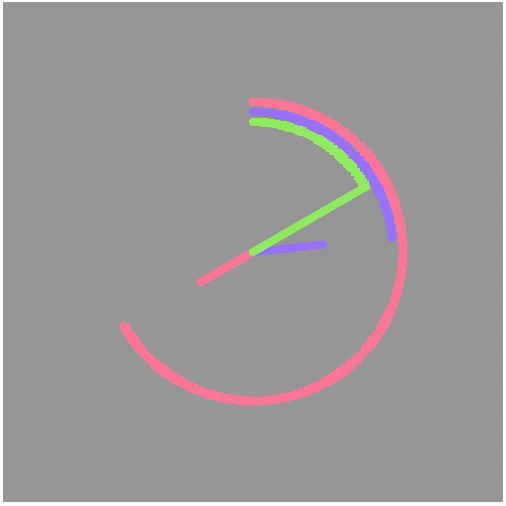

# Clock

Just a simple clock made with quil based on Daniel Shiffman's tutorial

## Medium

[Medium post](https://medium.com/ampersandas-clojure-thing/quil-making-a-clock-with-clojurescript-ea0ca58066dc)

## Usage

Run `lein figwheel` in your terminal. Wait for a while until you see `Successfully compiled "resources/public/js/main.js"`. Open [localhost:3449](http://localhost:3449) in your browser.

You can use this while developing your sketch. Whenever you save your source files the browser will automatically refresh everything, providing you with quick feedback. For more information about Figwheel, check the [Figwheel repository on GitHub](https://github.com/bhauman/lein-figwheel).

## Publishing your sketch

Before you publish your sketch, run `lein cljsbuild once optimized`. This will compile your code and run Google Closure Compiler with advanced optimizations. Take `resources/public/index.html` and `resources/public/js/main.js` and upload them to server of your choice.

## License

Copyright © 2017 FIXME

Distributed under the Eclipse Public License either version 1.0 or (at
your option) any later version.
